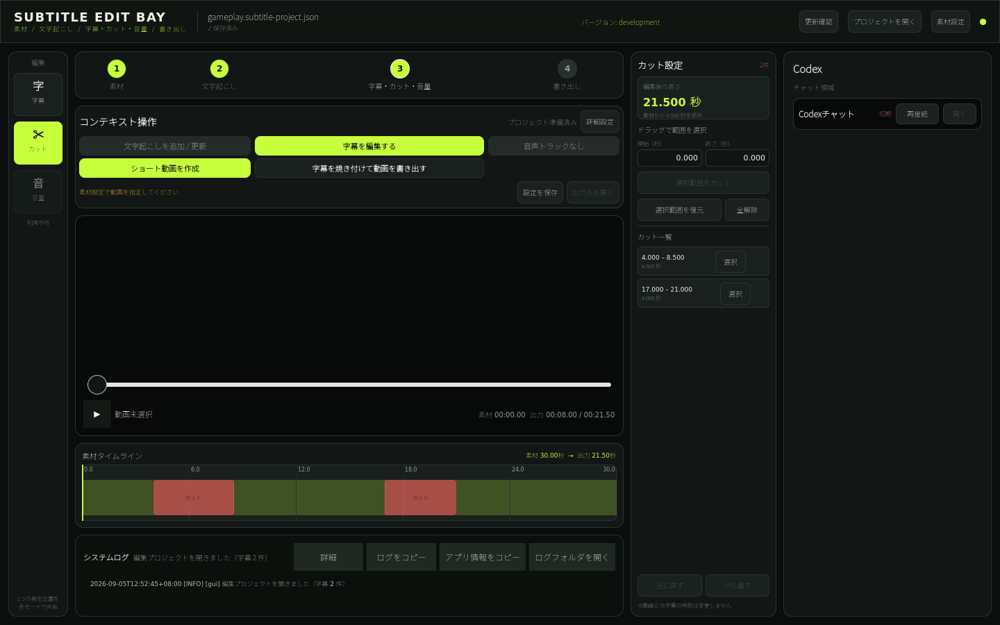

# 通常動画の非破壊カット

通常動画のカット編集は、元動画・元字幕を変更せず、出力から除外する素材時間の範囲だけをプロジェクトへ保存します。カットモードは字幕・音量モードと同じ動画プレイヤーとplayheadを共有し、専用の第二プレイヤーや別のモード状態を持ちません。

## 操作

1. 通常動画プロジェクトを開き、左のモードレールで `カット` を選ぶ
2. 素材タイムラインをドラッグするか、右側で開始・終了秒を入力する
3. `選択範囲をカット` を押す
4. 赤いカット範囲または一覧の項目を選ぶと、範囲変更または範囲全体の復元ができる
5. 選択中でない範囲を指定して `選択範囲を復元` を押すと、カットの一部だけを戻せる

`元に戻す`、`やり直す`、`全解除` も利用できます。編集後の長さは常に右側へ表示されます。再生中にカット範囲へ到達すると同じプレイヤーが次の残す範囲へ進み、一時停止中は元素材の位置を確認できます。

カットの作成、保存、再読込、時間計算にはWhisperX、CUDA、NVENC、Codexを必要としません。FFmpegは完成動画を書き出すときだけ使用し、利用可能なcodec選択は既存の書き出し処理に従います。

## プロジェクト形式

`timeline` は通常動画専用の状態です。各カットは再編集に使う安定IDと、元動画基準の半開区間 `[source_start, source_end)` を持ちます。

~~~json
{
  "timeline": {
    "schema_version": 1,
    "cuts": [
      {
        "id": "cut-0123456789ab",
        "source_start": 12.5,
        "source_end": 18.25
      }
    ]
  }
}
~~~

- 50ms未満の範囲と、動画全体を除外する操作は拒否する
- 重複または接するカットは一つへ正規化する
- 元素材の順序は維持し、残す区間の並べ替え状態は持たない
- 未知のtimeline／cutフィールドは再保存時にも維持する
- `timeline` がない既存プロジェクトは `cuts: []` として読み込む
- 字幕が0件でも、動画の長さが分かればカットできる
- 動画尺が未記録の場合は、GUIで開く際と書き出し時にffprobeで素材の実尺を取得する。最終字幕の終了時刻では代用せず、取得できない間はカット操作・カット書き出しを拒否する

ショート動画の `short_video` は別の編集結果です。通常動画のカットを追加・変更してもショートのクリップは変更せず、ショート書き出しへ通常動画のtimelineを暗黙適用しません。

## 素材時間と出力時間

保存する時刻の正本は常に素材時間です。出力時間はカットから算出します。

- 素材位置より前にあるカット時間の合計を引くと出力位置になる
- カット内部の素材位置は、そのカット直前の出力境界へ寄せる
- 出力境界から素材へ戻す場合は、次に残る区間の先頭を選ぶ
- `output_duration = source_duration - removed_duration`

この境界規則により、カット後のシーク先が除外区間へ戻らず、モードを切り替えても同じ素材位置と出力位置を保持できます。

## 字幕・音声・書き出し

字幕セグメントと音声ミックス設定は元素材基準のまま保存します。プレビューでは元字幕を元素材位置へ表示し、カットをまたぐ再生だけをスキップします。書き出し時には、同じkeep rangeを動画・音声へ適用し、ASSは一時的に次の規則で出力時間へ変換します。

- カット内だけにある字幕は出力しない
- カット境界と重なる字幕は残る部分へ切り詰める
- カット後の字幕は、それ以前に除外した時間だけ前へ移す

元の字幕時刻は更新しません。音声がない動画は音声フィルターと音声mapを作らずに書き出せます。

映像は保持フレームの素材時刻から除外時間を引いて、一つの出力時間軸へ直接配置します。音声は指定された区間長で独立して連結するため、カットごとの映像フレーム丸めが音声・字幕へ累積しません。実ファイルの末尾にはフレーム／音声サンプル単位の量子化が残りますが、カット数に比例して増えるずれは発生しません。

手動カットと `無音部分をカット` は別状態です。処理順は次のとおりです。

1. 手動カットから、元素材基準のkeep rangeを作る
2. 元素材の音声から、自動無音カットのkeep rangeを作る
3. 両方を有効にした場合はkeep range同士の共通部分を求める
4. 統合した同じ範囲を動画・音声・一時ASSへ適用する

自動判定結果を `timeline.cuts` へ書き戻さないため、自動無音カットの設定を変えても手動編集は保持されます。
