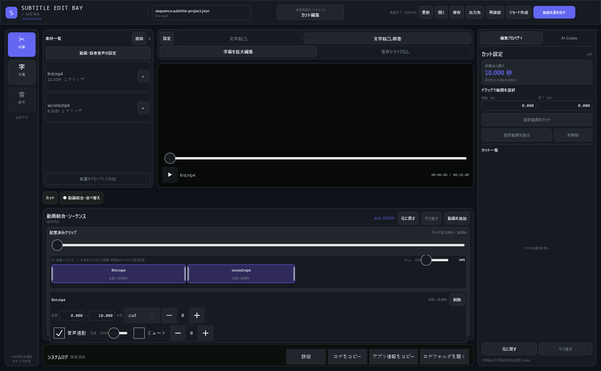
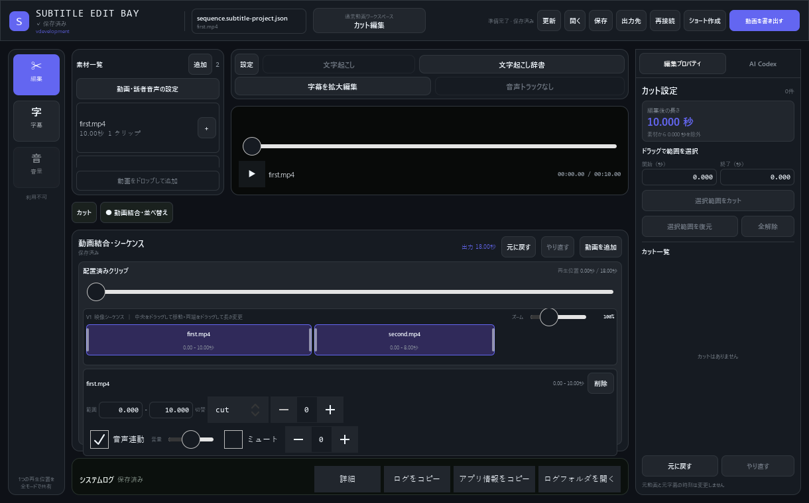
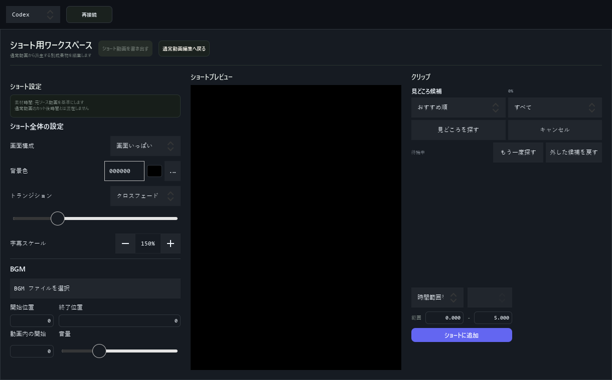

# UI mock 反映状況（Issue #440）

比較元は [UI mock](ui-redesign-mockup.html)。この変更は素材一覧の常設化と、通常動画・ショートの画面配置を対象とする。Issue #440 全体の完了ではない。

## 今回反映した内容

- 動画素材一覧を上段左側の独立パネルへ移動。字幕・カット・音量の各モードで表示し、下段の編集領域までは伸ばさない。
- 素材追加、ファイルドロップ登録、末尾へのクリップ追加を既存バックエンドへ接続。
- 素材カードを配置済みクリップへドラッグすると、その直前へ挿入する。挿入は1回の履歴操作となり、Undo・Redo・保存に対応する。
- 動画結合・並べ替えの編集パネルを動画上のオーバーレイから下部へ移動。素材一覧とプレビューの両方の下へ広げ、「カット」と「動画結合・並べ替え」で切り替える。
- シーケンスへ横方向の映像クリップ帯を追加。左右端のドラッグで使用範囲をトリムし、中央のドラッグでクリップ順を変更する。
- シーケンスのズームを50〜250%で変更し、クリップ幅とドラッグ時の時間換算を連動させる。
- 素材設定への入口を素材一覧に配置。
- 通常動画の書き出し・ショート作成・出力先をヘッダーに集約。文字起こし、辞書、拡大編集、処理停止はコンパクトなツールバーから操作する。設定保存は設定画面内に置く。
- システムログは通常時に1行へ折りたたむ。詳細・エラー時は展開する。
- 未認証のAIプロバイダー選択・ログインを通常編集画面の右設定パネル下部へ移動し、素材一覧との重なりを解消。
- 左レールを上から「編集」「字幕」「音量」の順に統一する。
- 右インスペクターを「編集プロパティ」「AI Codex」のタブ構成にし、認証前のログインと認証後のチャットを同じ枠内で切り替える。
- ショート画面を左＝設定、中央＝プレビュー、右＝クリップ・見どころ候補へ並べ替え。

## 残る差分

| Issue #440 の項目 | 状態・残る対応 |
| --- | --- |
| 素材一覧の配置・表示条件 | 上段左へ常設化し、下段編集領域と分離済み。字幕専用ソース選択への切り替えは未対応 |
| 素材フィルター・カード | 現在は動画名・長さ・使用クリップ数。音声素材分類、OP/ED、文字起こし対象表示は未対応 |
| 素材のドラッグ配置 | クリップ直前への挿入に対応。独立した音声トラックへの配置は未対応 |
| 字幕ソース選択・複数動画の素材設定 | 未対応。現在の単一動画＋話者音声設定を引き続き使用 |
| 編集ツール切り替え | カット／動画結合・並べ替えを分離。mockの3ツール構成とは異なる |
| シーケンスタイムライン | 素材一覧とプレビューを合わせた幅の下部へ移動し、横方向の映像クリップ操作と50〜250%のズームに対応。独立した音声・BGM/SEトラック表示は未対応 |
| 結合設定・BGM/SE | 既存のクリップ単位の設定を維持。OP/ED、全体トランジション、独立BGM/SEは未対応 |
| 字幕絞り込み | クリップ別フィルターは未対応 |
| インスペクター | 設定とAIを同じタブ枠に統合済み。既存AIプロバイダーの接続・ログイン導線を維持 |
| 操作導線 | ヘッダーとの重複と、左レールの「編集／字幕／音量」の順序を整理済み。ホーム・設定入口は未対応 |
| 書き出しモーダル | 未対応。現行の自動エンコード設定を使用 |
| ショート画面 | 左右配置は反映済み。クリップ／候補のタブ化は未対応 |
| 寸法・スタイル | 左右パネル・コンパクト表示を調整。mockとの全面一致は未完了 |

独立BGM/SEや複数動画単位の文字起こしは、画面に加えてデータモデル・保存・再生・出力処理の対応が必要。利用できない操作を仮のボタンとして表示しない。

## 確認手順

1. 動画プロジェクトを開き、左レールの編集・字幕・音量を切り替える。どのモードでも上段左側に素材一覧が残ることを確認する。
2. 素材を追加し、「カット」→「動画結合・並べ替え」を開く。追加素材を配置済みクリップへドラッグし、直前に追加されることを確認する。
3. 横シーケンスを50〜250%へズームし、クリップ幅が変わることを確認する。左右端をドラッグして使用範囲を変更し、中央をドラッグして順序を変更する。Undo・Redo、保存・再読み込みで反映を確認する。
4. 1220×760、1520×940で素材一覧・プレビュー・下部編集領域が重ならず、右インスペクターの編集プロパティ／AI Codexを切り替えられることを確認する。
5. ヘッダーからショートを開き、左に設定・右にクリップがあること、通常動画へ戻れることを確認する。
6. 処理中に素材の追加・挿入・クリップ編集が無効となり、停止ボタンを操作できることを確認する。

関連テストは `tests/test_gui_editor.py`、`tests/test_qml_static.py`、`tests/test_video_sequence.py`、`tests/test_gui_project_editor_controller.py`。

```powershell
python -m unittest tests.test_gui_editor tests.test_qml_static tests.test_video_sequence tests.test_gui_project_editor_controller
python -m ruff check src/gui.py tests/test_gui_editor.py tests/test_qml_static.py
```

## スクリーンショット

人工的に生成した動画を読み込んだGUIの配置確認。実際のユーザー素材は含まない。

### 1520×940



### 1220×760



### ショート画面（1220×760）

設定・候補・クリップ追加フォームを複数行に配置し、右端の操作が画面外へ出ないようにする。


