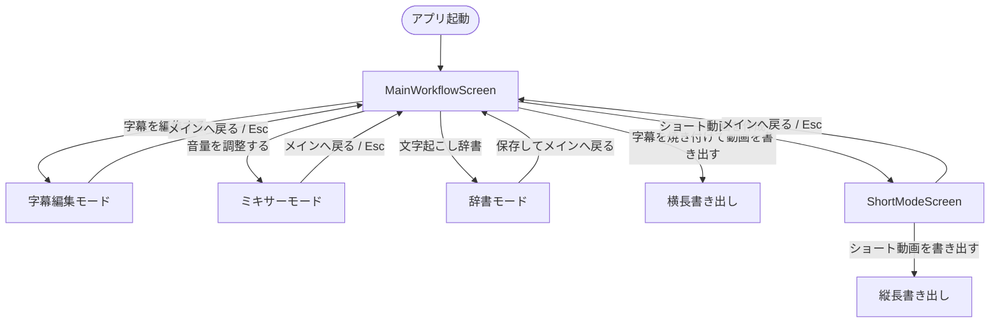
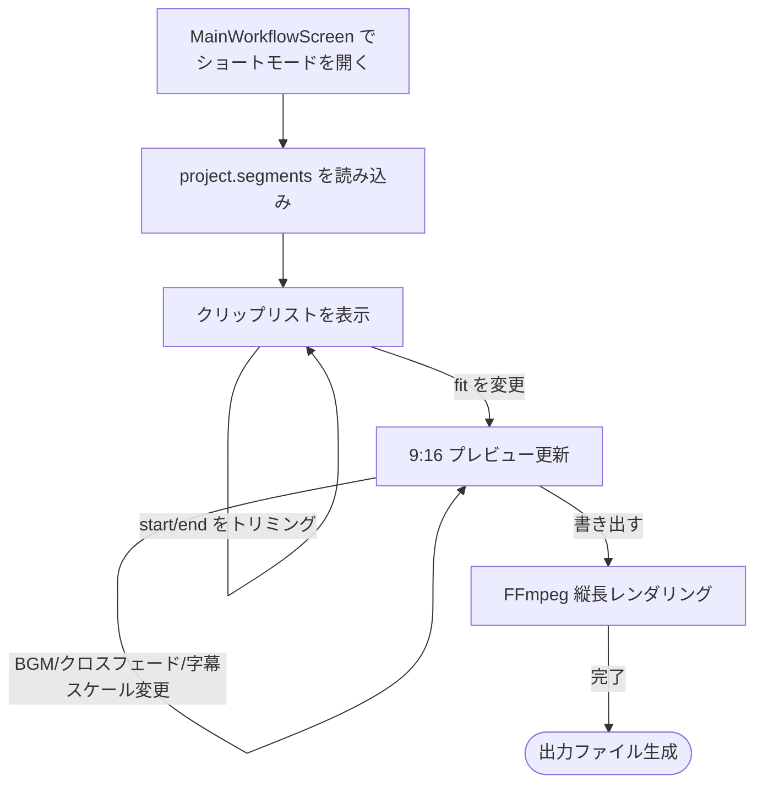

# subtitle-edit-bay ショートモード拡張 全体設計書

## 1. 背景と目的

`subtitle-edit-bay` はゲーム実況向け長尺動画の字幕生成・編集ツールである。  
YouTube Shorts / TikTok / Instagram Reels 向けの **9:16 縦長動画** を、既存の字幕・音声素材から短時間で作成できるモードを追加する。

既存の横長書き出しフローとは別に、**専用画面（Short Mode）** を提供する。  
字幕、話者情報、音声は既存プロジェクトを流用し、クリップ選択・並べ替え・縦長変換のみを新規実装する。

## 2. 非目標・制約

- `short-video-generator`（Node/TypeScript 側）のリポジトリは統合しない。
- 汎用プラグイン機構は新設せず、ビルトイン機能として `src/short_video/` に閉じる。
- 初版ではクリップ元は 1 本の編集済み動画に限定する。複数ソースの混ぜ合わせは今後の拡張。
- 縦長画面での文字起こし UI は作らない。文字起こしは通常の `MainWorkflowScreen` で済ませ、ショート化は書き出し段階で行う。
- プレビューは「fit（cover / contain / blur）」の近似表示で済ませ、完全な filter_complex 再現は書き出し時に行う。

## 3. 既存画面アーキテクチャ

### 3.1 QML ルート

```
src/ui/Main.qml
  └─ MainWorkflowScreenWithContext.qml
       └─ MainWorkflowScreen.qml
            ├─ mainWorkspace       通常の横長メイン作業画面
            ├─ editorPage          字幕編集オーバレイ
            ├─ mixerPage           ミキサーリング編集オーバレイ
            └─ (shortModePage)     今回追加するショートモードオーバレイ
```

`MainWorkflowScreenWithContext.qml` は `MainWorkflowScreen.qml` を継承し、  
`dictionaryPage`（文字起こし辞書）を追加で重ねている。

### 3.2 既存のモード切り替え

`MainWorkflowScreen.qml` 内で `editorMode` / `mixerMode` / `dictionaryMode` の 3 つの `bool` プロパティが定義されている。

```qml
property bool editorMode: false
property bool mixerMode: false
property bool dictionaryMode: false
```

各モードに対して `Rectangle` + `Loader` によるオーバレイページがあり、  
`open*Screen()` / `close*Screen()` 関数で `mainPlayer` の停止・位置の保存と復元を行う。

```qml
function openEditorScreen() {
    if (!root.mixerMode) {
        root.editorPositionCache = mainPlayer.position
        mainPlayer.pause()
    } else
        root.appBackend.stopAudioMixerPreview()
    root.mixerMode = false
    root.dictionaryMode = false
    root.editorMode = true
}

function closeEditorScreen() {
    mainPlayer.position = root.editorPositionCache
    root.editorMode = false
}
```

`header` と `mainWorkspace` の表示切り替えは以下の条件で統一されている。

```qml
header.visible: !root.editorMode && !root.mixerMode && !root.dictionaryMode
mainWorkspace.visible: !root.editorMode && !root.mixerMode && !root.dictionaryMode
```

### 3.3 画面遷移図（ShortModeScreen 追加後）

`ShortModeScreen` は `MainWorkflowScreen.qml` 内の `shortModePage`（`Loader` + `Rectangle` オーバレイ）として追加される。別ウィンドウではない。



## 4. ShortModeScreen の遷移トリガー

### 4.1 遷移表

| 遷移 | トリガー | 備考 |
|------|---------|------|
| `MainWorkflowScreen` → `ShortModeScreen` | 右パネル「ショート動画を作成」ボタン | プロジェクト読み込み済み & 字幕セグメントあり & 処理中でない |
| `ShortModeScreen` → `MainWorkflowScreen` | 「メインへ戻る」ボタン / `Esc` | 変更はプロジェクトに随時保存 |
| `ShortModeScreen` → レンダリング | 「ショート動画を書き出す」ボタン | バックグラウンドで `src.subtitle_workflow short` を実行 |
| Editor / Mixer / Dictionary → Short | MVP では非対応 | 必ず `Main` を経由して遷移 |

### 4.2 追加される位置

- `MainWorkflowScreen.qml` に `shortMode` プロパティと `shortModePage`（`Loader` + `Rectangle` オーバレイ）を追加する。
- `MainWorkflowScreenWithContext.qml` は `MainWorkflowScreen` を継承しているため、辞書モードと同じウィンドウで `ShortModeScreen` を開ける。
- `MainWorkflowScreen` 右パネルの `workflowActions` 内に「ショート動画を作成」ボタンを追加する。`projectLoaded` かつ字幕セグメントが存在し、処理中でない場合に有効。

## 5. ShortModeScreen の構成

### 5.1 レイアウト

```
ShortModeScreen
  ├─ ヘッダー（タイトル + メインへ戻る + 書き出す）
  └─ 2 カラムレイアウト
       ├─ 左: 9:16 プレビュー + 再生コントロール
       └─ 右: 上下分割
            ├─ 上: クリップリスト（縦長リスト）
            └─ 下: 設定パネル
```

### 5.2 新規 QML ファイル

| ファイル | 役割 |
|---------|------|
| `src/ui/screens/ShortModeScreen.qml` | ショートモード画面本体。9:16 プレビュー、クリップリスト、設定パネルを配置 |
| `src/ui/components/ShortModeClipList.qml` | 選択したクリップを縦に並べるリスト。並べ替え・トリミング・fit 変更 |
| `src/ui/components/ShortModeSettingsPanel.qml` | fit、背景色、クロスフェード、BGM、字幕スケール設定 |
| `src/ui/components/ShortModePreview.qml` | 9:16 プレビュー + 字幕オーバーレイ（MediaPlayer + VideoOutput） |

### 5.3 MainWorkflowScreen への追加

```qml
property bool shortMode: false

function openShortModeScreen() {
    root.editorPositionCache = mainPlayer.position
    mainPlayer.pause()
    root.appBackend.stopAudioMixerPreview()
    root.editorMode = false
    root.mixerMode = false
    root.dictionaryMode = false
    root.shortMode = true
}

function closeShortModeScreen() {
    root.shortMode = false
    mainPlayer.position = root.editorPositionCache
}

header.visible: !root.editorMode && !root.mixerMode && !root.dictionaryMode && !root.shortMode
mainWorkspace.visible: !root.editorMode && !root.mixerMode && !root.dictionaryMode && !root.shortMode

Rectangle {
    id: shortModePage
    objectName: "shortModePage"
    anchors.fill: parent
    visible: root.shortMode
    z: 100
    color: "#0D1210"
    focus: visible
    Keys.onEscapePressed: root.closeShortModeScreen()
    onVisibleChanged: if (visible) forceActiveFocus()

    Loader {
        anchors.fill: parent
        active: root.shortMode
        source: "ShortModeScreen.qml"
    }
}
```

### 5.4 ワークフローアクションへのボタン追加

```qml
Button {
    id: shortModeOpenButton
    objectName: "shortModeOpenButton"
    Layout.fillWidth: true
    Layout.preferredHeight: 46
    visible: root.appBackend.projectLoaded && root.appBackend.subtitleSegments.length > 0
    enabled: !root.appBackend.running
    text: "ショート動画を作成"
    onClicked: root.openShortModeScreen()
}
```

## 6. ショートモード内部フロー



## 7. データモデル

### 7.1 プロジェクト内 `short_video` セクション

```json
{
  "short_video": {
    "enabled": true,
    "output": {
      "width": 1080,
      "height": 1920,
      "fps": 30
    },
    "global_fit": "cover",
    "global_background_color": "000000",
    "subtitle_scale_percent": 150,
    "transition": {
      "type": "crossfade",
      "duration": 0.5
    },
    "bgm": {
      "path": "",
      "in": 0,
      "out": 60,
      "start": 0,
      "volume": 0.3
    },
    "clips": [
      {
        "segment_id": "seg-uuid-1",
        "start": 12.5,
        "end": 18.0,
        "fit": "cover",
        "background_color": "000000"
      }
    ]
  }
}
```

- `clips` は選択した `segments` の一部分を表す。`segment_id` は既存 `segments[].id` を参照。
- `fit` はクリップごとに指定可能。未指定時は `global_fit` を継承。
- `bgm` はトータル出力時間に対してループ / 遅延 / 音量を調整する。

### 7.2 `RuntimeSettings` 追加案

`src/runtime_settings.py` に `ShortModeSettings` グループを追加する。

```python
@dataclass(frozen=True)
class ShortModeSettings:
    short_mode_enabled: bool = False
    short_mode_output_width: int = 1080
    short_mode_output_height: int = 1920
    short_mode_output_fps: int = 30
    short_mode_global_fit: str = "cover"
    short_mode_global_background_color: str = "000000"
    short_mode_transition_type: str = "crossfade"
    short_mode_transition_duration: float = 0.5
    short_mode_bgm_path: str = ""
    short_mode_bgm_in: float = 0.0
    short_mode_bgm_out: float = 0.0
    short_mode_bgm_start: float = 0.0
    short_mode_bgm_volume: float = 0.3
    short_mode_subtitle_scale_percent: float = 150.0
```

クリップ配列は `project["short_video"]["clips"]` に保持し、  
`RuntimeSettings` には出力設定・BGM・グローバル fit などを置く。

### 7.3 新規 Python モジュール

| ファイル | 役割 |
|---------|------|
| `src/short_video_schema.py` | クリップ、BGM、トランジションの dataclass とバリデーション |
| `src/short_video.py` | クリップ選択 → FFmpeg `filter_complex` 構築 → `run_atomic_ffmpeg_export` |
| `src/short_video_ass.py` | クリップタイムラインにリマップした縦長 ASS 生成 |

### 7.4 既存ファイルへの変更

| ファイル | 変更内容 |
|---------|----------|
| `src/subtitle_project.py` | `short_video` セクションのマイグレーション・正規化 |
| `src/subtitle_workflow.py` | 短長書き出しコマンド分岐。`short_mode` 有効時に `short_video.render_short_video` を呼ぶ |
| `src/gui.py` | `openShortModeScreen`、`closeShortModeScreen`、`renderShortVideo` スロット追加 |
| `src/gui_state.py` | `build_gui_short_video_command` 追加（必要に応じて） |
| `src/ui/screens/MainWorkflowScreen.qml` | `shortMode` プロパティ・遷移関数・ボタン・オーバレイ追加 |
| `src/ui/screens/MainWorkflowScreenWithContext.qml` | `shortMode` はベースクラスで扱うため変更なし（影響なし） |

## 8. 横→縦変換（fit）

出力 `1080×1920`、`fps=30` を例にする。

### 8.1 cover（中央クロップ / 拡大）

```
scale=-2:1920:force_original_aspect_ratio=decrease,
crop=1080:1920:(iw-ow)/2:(ih-oh)/2,
format=yuv420p,
fps=30,
setpts=PTS-STARTPTS,
setsar=1
```

### 8.2 contain（フィット / レターボックス）

```
scale=1080:1920:force_original_aspect_ratio=decrease,
pad=1080:1920:(ow-iw)/2:(oh-ih)/2:000000,
format=yuv420p,
fps=30,
setpts=PTS-STARTPTS,
setsar=1
```

### 8.3 blur（背景ブラー＋フィット）

```
split[orig][fill];
[fill]scale=1080:1920:force_original_aspect_ratio=increase,
crop=1080:1920,
boxblur=40:40,
format=yuv420p[bg];
[orig]scale=1080:1920:force_original_aspect_ratio=decrease[fg];
[bg][fg]overlay=(W-w)/2:(H-h)/2:format=auto,
fps=30,
setpts=PTS-STARTPTS,
setsar=1
```

各クリップは上記のいずれかを適用したあとでクリップ間クロスフェードに入る。

## 9. クロスフェードと BGM

### 9.1 クリップ間クロスフェード

`xfade`（映像）と `acrossfade`（音声）を使用する。  
事前に各クリップを同じ解像度・ピクセルフォーマット・フレームレートに正規化しておく。

```
[s0][s1]xfade=transition=fade:duration=0.5:offset=2.5[x0];
[x0][s2]xfade=transition=fade:duration=0.5:offset=5.0[v0]
```

オフセットは直前クリップ終了時刻からトランジション時間を引いた値。

### 9.2 BGM ミックス

FFmpeg 入力インデックス:

- `0:v:0`, `0:a:0` : 元動画
- `1:a:0` 以降: BGM 等の外部音声

BGM 用フィルタ例:

```
[bgm_input]atrim=0:bgm_duration,asetpts=PTS-STARTPTS,
aloop=loop=-1:size=bgm_loop_samples,
atrim=0:bgm_needed_duration,
adelay=delays=bgm_start_samplesS:all=1,
volume=0.3,
aformat=sample_fmts=fltp:sample_rates=48000:channel_layouts=stereo[bgm]
```

メイン音声:

```
[main_input]atrim=0:total_duration,asetpts=PTS-STARTPTS,
aformat=sample_fmts=fltp:sample_rates=48000:channel_layouts=stereo[main]
```

ミックス:

```
[main][bgm]amix=inputs=2:duration=first:dropout_transition=0:normalize=0:weights='1 1'[aout]
```

`bgm_loop_samples` は `ffprobe` の `sample_rate` を使って計算する。

```python
loop_samples = int(bgm_duration_seconds * sample_rate)
```

## 10. 字幕（ASS）対応

- `short_video_ass.py` で、クリップ配列に従って字幕セグメントの時刻をリマップする。
- `src/render_ass.py` の `render_ass` を `width=1080`、`height=1920` で呼び出し、
  `subtitle_font_size` を `subtitle_scale_percent` で拡大する。
- 最終的な `[v0]` 映像に対して `ass='/path/to/short.ass'` を適用する。

## 11. FFmpeg パイプライン全体

```bash
ffmpeg -y -i video.mp4 -i bgm.mp3 \
  -filter_complex "...;[v0]ass='/tmp/short.ass'[v]" \
  -map "[v]" -map "[aout]" \
  -c:v libx264 -preset medium -crf 18 -r 30 -pix_fmt yuv420p \
  -c:a aac -b:a 192k -movflags +faststart \
  output_short.mp4
```

- `filter_complex` が長くなる場合は一時ファイル化し、FFmpeg 6 では
  `-filter_complex_script`、FFmpeg 7 以降では `-/filter_complex` を使う。
  判定不能またはサポート外の場合は、FFmpeg の更新とセットアップ再検証を案内する。
- `run_atomic_ffmpeg_export` を使い、NVENC 失敗時は libx264 にフォールバックする。

## 12. UI 設計の詳細

### 12.1 ShortModeScreen.qml

```qml
import QtQuick
import QtQuick.Controls
import QtQuick.Layouts
import QtMultimedia

Item {
    id: shortRoot
    anchors.fill: parent

    ColumnLayout {
        anchors.fill: parent; anchors.margins: 20; spacing: 14

        // ヘッダー
        RowLayout {
            Layout.fillWidth: true
            Text {
                text: "ショート動画作成"
                color: "#E8EFEA"
                font.family: "Yu Gothic UI"
                font.pixelSize: 18
                font.weight: Font.Bold
            }
            Item { Layout.fillWidth: true }
            SmallButton {
                text: "メインへ戻る"
                onClicked: root.closeShortModeScreen()
            }
            SmallButton {
                text: "ショート動画を書き出す"
                onClicked: root.appBackend.renderShortVideo(root.shortModeSettings())
            }
        }

        // メイン 2 カラム
        RowLayout {
            Layout.fillWidth: true
            Layout.fillHeight: true
            spacing: 20

            // 9:16 プレビュー
            Rectangle {
                Layout.preferredWidth: 540
                Layout.preferredHeight: 960
                color: "#080A09"
                border.color: root.border
                clip: true

                MediaPlayer {
                    id: shortPreviewPlayer
                    source: root.appBackend.previewUrl
                    videoOutput: shortVideo
                    audioOutput: AudioOutput { volume: 0.7 }
                }

                VideoOutput {
                    id: shortVideo
                    anchors.fill: parent
                    fillMode: VideoOutput.PreserveAspectCrop
                }

                SubtitleOverlay {
                    anchors.fill: parent
                    player: shortPreviewPlayer
                    captionObjectPrefix: "shortSubtitleOverlayCaption"
                }
            }

            // 右ペイン
            ColumnLayout {
                Layout.fillWidth: true
                Layout.fillHeight: true
                spacing: 12

                ShortModeClipList {
                    Layout.fillWidth: true
                    Layout.fillHeight: true
                }

                ShortModeSettingsPanel {
                    Layout.fillWidth: true
                    Layout.preferredHeight: 320
                }
            }
        }
    }
}
```

### 12.2 ShortModeClipList.qml

- `ListView` または `ColumnLayout` + `Repeater` でクリップを縦に並べる。
- 各アイテムに以下を表示:
  - サムネイル（1 フレーム目を `Image` で表示）
  - 話者名、字幕テキスト（先頭 30 文字）
  - 開始/終了時刻
  - fit 選択 `ComboBox`
  - ▲▼ 並べ替えボタン、✕ 削除ボタン
- トリミングは初版では数値入力（`TimeField`）で行う。

### 12.3 ShortModeSettingsPanel.qml

- `fit` 選択（cover / contain / blur）
- 背景色ピッカー
- クロスフェード秒数スライダー（0.0 〜 2.0）
- 字幕スケールスピンボックス（50 〜 300%）
- BGM ファイルピッカー
- BGM IN / OUT / START / 音量

## 13. テスト計画

### 13.1 単体テスト

| ファイル | 内容 |
|---------|------|
| `tests/test_short_video_schema.py` | クリップ、BGM、トランジションのバリデーション、デフォルト値 |
| `tests/test_short_video.py` | `build_short_video_filter_complex()` の戻り値検証。FFmpeg は実行しない |
| `tests/test_short_video_ass.py` | クリップリマップ後の ASS 時刻、縦長 ASS ヘッダー |
| `tests/test_gui_short_mode.py` | offscreen 環境で `ShortModeScreen` のロード、設定構築 |

`test_short_video.py` で確認するケース:

- 1 クリップ only
- 2 クリップ + クロスフェード
- BGM あり / なし
- fit ごとのフィルタ文字列（`scale=`, `crop=`, `pad=`, `boxblur=`）
- 字幕 `ass=` がフィルタ末尾に含まれること

### 13.2 GUI / QML テスト

offscreen 用環境変数:

```bash
export QT_QPA_PLATFORM=offscreen
export QT_QUICK_BACKEND=software
export QT_QUICK_CONTROLS_STYLE=Basic
export QSG_RHI_BACKEND=software
```

### 13.3 スモークテスト

- `RUN_FFMPEG_SMOKE=1` 環境で短いテスト動画に対し `short_mode` レンダリングを実際に実行。
- 出力を `ffprobe` で検証:
  - `width=1080`, `height=1920`
  - `duration > 0`
  - 音声ストリームあり

### 13.4 実行コマンド

```bash
source .venv/bin/activate
python -m unittest discover tests
ruff check src tests
```

必要に応じて:

```bash
RUN_FFMPEG_SMOKE=1 python -m unittest tests.test_short_video
```

## 14. PR 分割案

AGENTS.md により、PR タイトル・コミットメッセージは日本語。

1. **ショートモード用プロジェクトスキーマと設定を追加**  
   `src/short_video_schema.py`、`src/runtime_settings.py`、`src/subtitle_project.py`

2. **MainWorkflowScreen から ShortModeScreen への遷移を追加**  
   `src/ui/screens/MainWorkflowScreen.qml` に `shortMode` プロパティと `openShortModeScreen` 関数、  
   `workflowActions` にボタン、`ShortModeScreen.qml` の骨格

3. **ShortModeScreen にクリップ選択と縦長プレビューを追加**  
   `ShortModeClipList.qml`、`ShortModePreview.qml`、9:16 MediaPlayer / VideoOutput

4. **縦長動画用 FFmpeg filter_complex 構築を追加**  
   `src/short_video.py`、fit 変換、クロスフェード、字幕焼き付け

5. **BGM とクロスフェード設定を UI とパイプラインに追加**  
   `ShortModeSettingsPanel.qml`、`src/audio_mixer.py` BGM 対応

6. **縦長 ASS 字幕レンダリングに対応**  
   `src/short_video_ass.py`、クリップタイムライン上のリマップ ASS 生成

7. **ショートモードの単体テストとスモークテストを追加**  
   `tests/test_short_video*.py`、`tests/test_gui_short_mode.py`、ruff / CI 整備

## 15. リスクと対策

| リスク | 対策 |
|-------|------|
| `xfade` / `acrossfade` が古い FFmpeg で使えない | CI FFmpeg バージョンを確認。使えない場合はテストをスキップし、ユーザーに FFmpeg 更新を促すメッセージを出す |
| `filter_complex` が長くなる | 一時ファイル化し、FFmpeg のメジャーバージョンに対応するファイル入力オプションを使う |
| BGM の `aloop` サンプル数計算がずれる | `ffprobe` の `sample_rate` を使い整数サンプルで計算。境界値テストを書く |
| クリップのトリミング・並べ替えで字幕がずれる | `src/silence_cut.py` の `retime_segments_for_keep_ranges` を流用し、クリップ区間ごとに `output_cursor` を加算 |
| 縦長 UI で既存レイアウトが崩れる | `ShortModeScreen` を `MainWorkflowScreen` 上のモードオーバレイとして実装し、既存 `mainWorkspace` には影響しない |
| `short-video-generator` との重複 | 統合しない。必要なら Timeline JSON エクスポートを将来別 PR で追加する |

## 16. 未決事項

- クリップのトリミング UI（スライダーか数値入力か）
- クリップリストのドラッグ＆ドロップ並べ替え（▲▼ だけでも初版は可）
- 複数動画ソースからのクリップ構成
- テンプレートプリセット（YouTube Shorts / TikTok / Instagram Reels）
- `short-video-generator` 向け Timeline JSON エクスポートとの連携
- 縦長プレビューで boxblur fit のリアルタイム再現（MVP では `fillMode` で近似）

## 17. 実装状態

2026-08時点のユーザー向けショートモードは、既存の字幕プロジェクトからクリップを選び、9:16プレビューを確認してFFmpegで書き出すところまで実装済みです。

### 実装済み

- MainWorkflowScreenからShortModeScreenを開く
- クリップの追加、削除、並べ替え、開始・終了トリミング
- `cover`、`contain`、`blur` のfitと背景色
- クリップ間のcut / crossfade
- BGMのIN / OUT / START / volumeとループ
- 縦長ASS生成、字幕リマップ、字幕スケール、話者色
- FFmpegスクリプト入力とNVENCからlibx264へのフォールバック

### 未実装・制約

- 複数動画または複数字幕プロジェクトを1本のshort timelineへ混在させること
- 字幕や音声から見どころ候補を自動抽出すること
- SNS別テンプレート、サムネイル生成、候補の個人最適化
- `blur` のリアルタイムプレビュー。プレビューはVideoOutputの近似で、完成動画のboxblurと完全一致しない

実装状態はコードと受け入れ条件の差分を基準に更新し、未対応の項目を利用ガイドで対応済みと表記しない。
